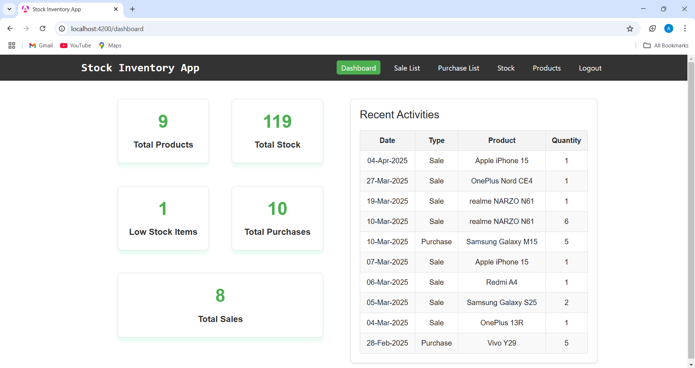
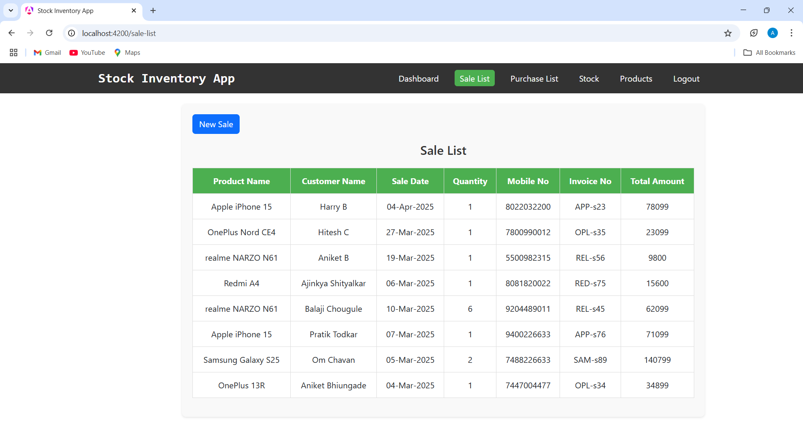
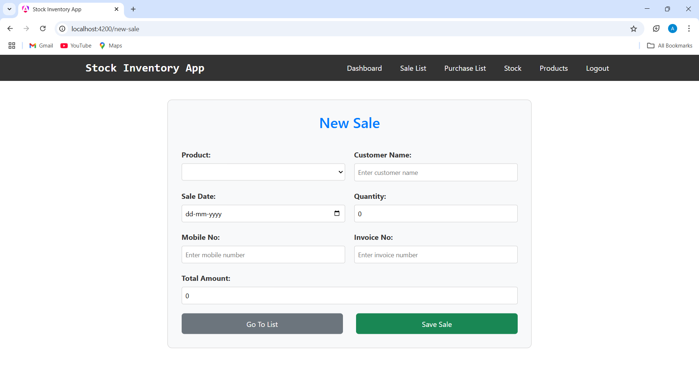
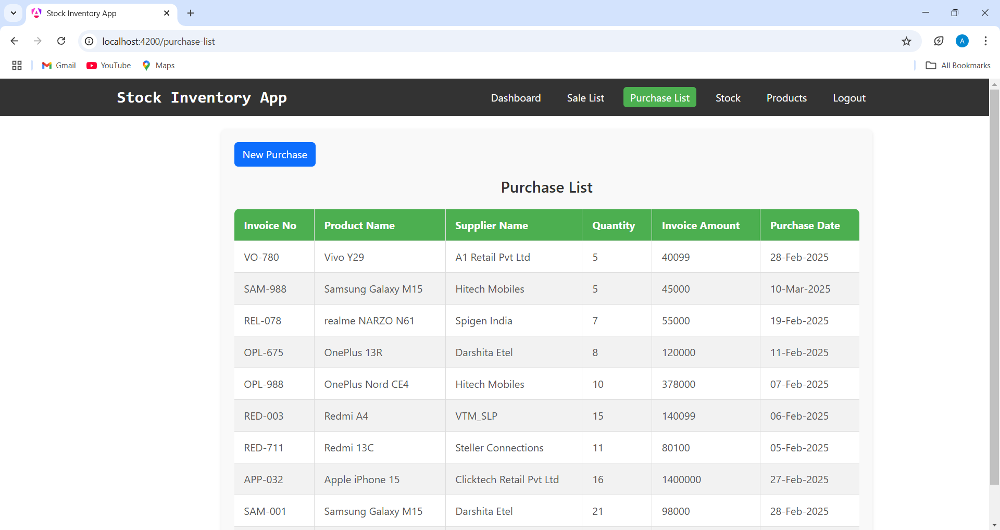
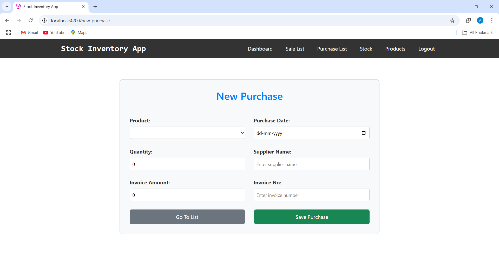
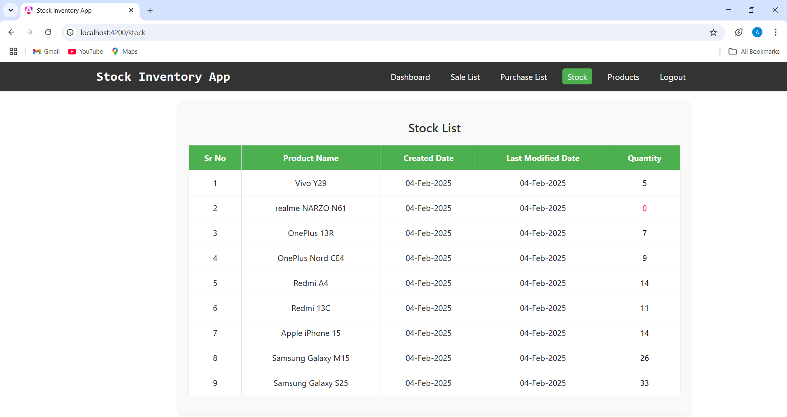
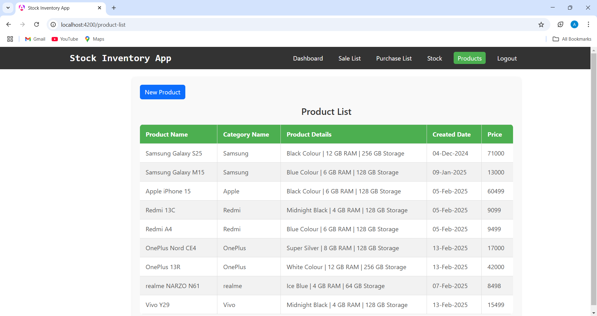
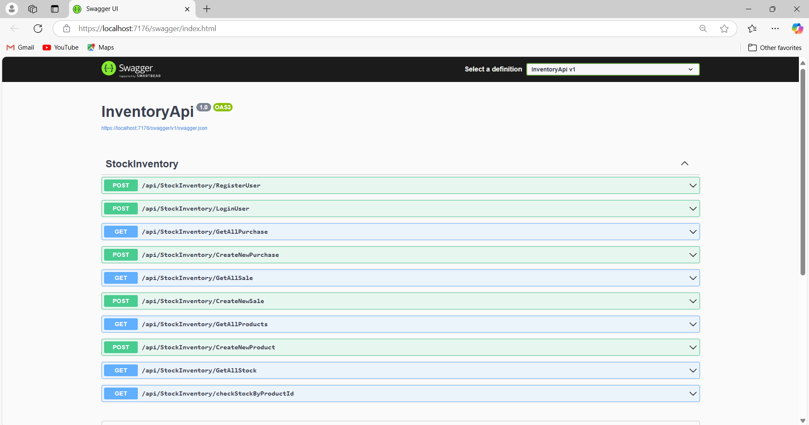

# Stock Inventory Application

## Overview
A web-based inventory management system built with **Angular**, **ASP.NET Core Web API** and **Microsoft SQL Server**. This application helps businesses track stock, manage purchases and sales, and monitor inventory levels efficiently.

---

## Purpose & Problem Solved

### **Purpose**
The Stock Inventory Application is designed to help businesses efficiently manage their stock, sales, and purchases in a structured manner. It provides a user-friendly interface for:
- Tracking inventory levels.
- Preventing stock shortages.
- Maintaining accurate transaction records.

### **Problems Solved**
✅ **Stock Mismanagement**: Helps businesses keep real-time track of stock levels, avoiding overstocking or shortages.  
✅ **Manual Record-Keeping**: Eliminates the need for spreadsheets or paper-based tracking by providing a digital solution.  
✅ **Sales & Purchase Tracking**: Ensures every sale and purchase is recorded properly, reducing errors in bookkeeping.  
✅ **User Access Control**: Allows only authenticated users to access sensitive inventory data, enhancing security.

---

## Screenshots

### **Dashboard**

### **Sale List**

### **New Sale**

### **Purchase List**

### **New Purchase**

### **Stock List**

### **Product List**

### **API Endpoints (Swagger UI)**

---

